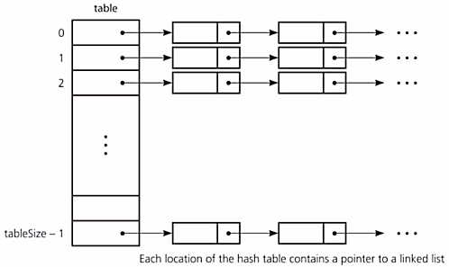

# :hash: Tabela Hash - Endereçamento Fechado

_Closed Address Hashing_ ou _hashing_ encadeado é a forma mais simples de tratamento de colisão. Cada entrada `H[i]` da 
tabela _hash_ é uma lista ligada, cujos elementos têm hash code `i`. 

